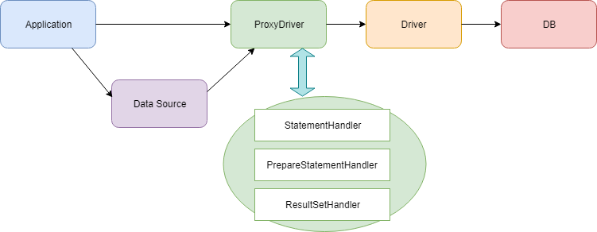

# slf4sql
slf4sql is a library for SQL logging using slf4j.

## slf4sql in brief

This is how it works:
- slf4sql provides the statement interceptor at the `Driver` level, which is much more convenient for Java applications because the `DataSource` is provided by the application server.

## Usage

- Add slf4sql-x.x.x.jar into your project.
- Change driver class name to `sb.slf4sql.ProxyDrive`.
- Change driver url to `sb.slf4sql.ProxyDrive`.

### Spring Boot
```
Example
```

### MyBatis
```
Example
```

### Java
```
Example
```

```html
<logger name="org.hibernate.SQL" level="debug"/>
```

## Prerequisites
* JDK 8 or later
* [SLF4J](https://www.slf4j.org/) - Simple Logging Facade for Java


```
Give examples
```
